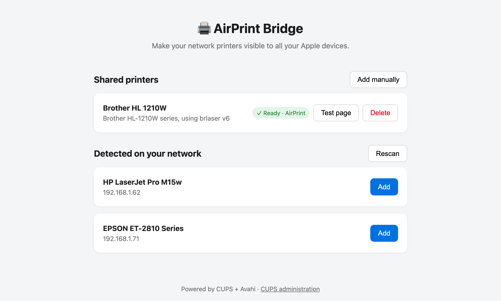

# AirPrint Bridge

Print from your iPhone, iPad or Mac to any network printer — even one that doesn't support AirPrint.

Run one container, open the web page: printers on your network are detected automatically, and one click makes them visible to all your Apple devices.



## Quick start

```yaml
# docker-compose.yml
services:
  airprint:
    image: ghcr.io/moifort/airprint:main
    container_name: airprint
    # Required: AirPrint relies on mDNS (multicast), which does not
    # cross Docker's bridge network.
    network_mode: host
    restart: unless-stopped
    environment:
      UI_PORT: "8080"
    volumes:
      - /DATA/AppData/airprint/cups:/etc/cups
```

```bash
docker compose up -d
```

Open `http://<server-ip>:8080`, wait a few seconds for the scan, then click **Add** next to your printer. It now shows up in the print dialog of every Apple device on the network.

If your printer isn't detected, **Add manually** lets you enter its IP address, search the bundled driver database, or upload the manufacturer's PPD file.

### CasaOS

App Store → **Install a customized app** (`+` icon) → paste the compose above.

## How it works

The container bundles **CUPS** (the printing system), **Avahi** (Bonjour/mDNS) and the **OpenPrinting driver database** (Gutenprint, HPLIP, brlaser, SpliX, foomatic…):

1. the network is scanned over **SNMP broadcast** and **Bonjour** — printers answer with their model and connection URI;
2. the right driver is matched automatically — by IEEE 1284 device ID first, then by make-and-model;
3. the printer becomes a CUPS queue announced over mDNS — which is all AirPrint is.

`network_mode: host` is required because Apple devices discover printers through mDNS multicast, which does not cross Docker's bridge network.

## Configuration

| | Purpose |
|---|---|
| `UI_PORT` (default `8080`) | Web interface port |
| Port `631` | Classic CUPS administration at `http://<server-ip>:631` |
| Port `5353/udp` | mDNS (Avahi) — Bonjour announcements |
| Volume `/etc/cups` | Printer configuration (persists queues across restarts) |

## Troubleshooting

- **The printer doesn't show up on the Mac**: check the `host` network mode, then run `dns-sd -B _ipp._tcp` on a Mac — the printer must be listed. Also make sure the server and the Mac are on the same network/VLAN.
- **The printer appears then disappears, or shows up as `name @ host-34`**: two mDNS responders on the same host are fighting over the records. Run only **one** mDNS responder per host: disable the host's avahi (`systemctl disable --now avahi-daemon`) and the embedded avahi of other containers (e.g. Homebridge: set `ENABLE_AVAHI=0`).
- **Model not detected**: some printers expose neither SNMP nor IPP. Use the manual driver search or provide the manufacturer's PPD file.
- **Printing fails despite detection**: try another connection in the selector (`socket://` works on most printers, port 9100).

## Development

```bash
pip install -r requirements-dev.txt
pytest

docker build -t airprint .
docker run --rm --network host airprint
```

On every push to `main` (and `v*` tag), the multi-architecture image (amd64 + arm64) is published to GHCR by GitHub Actions.
